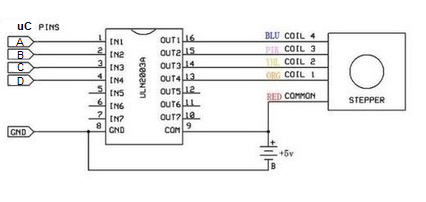

# Stepper_motor_API

## Introduction
This API was developed as a work in the discipline of Embedded Systems Programming at UFMG - Prof. Ricardo de Oliveira Duarte - Department of Electronic EngineeringLibrary is 
developed and tested with STM32F1xx (Nucleo 64 board). You can check the examples given.

## Hardware requirements
* STM32F41xx microntroller;
* 28BYJ-48 5V stepper motor or similar (unipolar 4 leads);
* Driver ULN2003 IC or similar;
* 5V external power supply.

## Connections
The following image shows the connections diagram between the hardware elements. The depicted motor is the 28BYJ-48 5V model, if you wish to use another motor, you just need to
find the correct pahse sequence, the following table shows the correspondece between the pins, pahses and the 28BYJ-48 5V leads.



*Connection diagram. Source: adapted from https://www.filipeflop.com/produto/motor-de-passo-driver-uln2003-arduino/*

| Pin on diagram | Phase sequence number | Lead color on 28BYJ-48 5V |
|----------------|-----------------------|---------------------------|
| D              | 1                     | blue                      |
| C              | 2                     | pink                      |
| B              | 3                     | yellow                    |
| A              | 4                     | orange                    |
| 5V             | common                | red                       |

## Feature files
* API files
  * STEP_MOTOR_28BYJ-48-5V_NUCLEO-64_STMF103.c
  * STEP_MOTOR_28BYJ-48-5V_NUCLEO-64_STMF103.h

* Example files
  * main.h
  * stm32f1xx_hal_msp.h
  * stm32f1xx_it.h
  * main.c
  * stm32f1xx_hal_msp.c
  * stm32f1xx_it.c
  * syscalls.c
  * system_stm32f1xx.c
  
## API configuration
1. Download STEP_MOTOR_28BYJ-48-5V_NUCLEO-64_STMF103.c from the Stepper_motor_API/Core/Src and STEP_MOTOR_28BYJ-48-5V_NUCLEO-64_STMF103.h from the Stepper_motor_API/Core/Inc 
directory;
2. Copy STEP_MOTOR_28BYJ-48-5V_NUCLEO-64_STMF103.h to your projec's Inc directory and the STEP_MOTOR_28BYJ-48-5V_NUCLEO-64_STMF103.c to your projec's Src directory;
3. Configure some timer to generate interruptions every 1 ms;
4. Configure four pins as digital GPIO output;
5. Include the STEP_MOTOR_28BYJ-48-5V_NUCLEO-64_STMF103.h file to the stm32f1xx_it.c file;
6. Add the ```turn_controller()``` function to the ```TIM<x>_UP_IRQHandler()``` function, where x is the timer used;

Obs.: If you wish to use this API with a microncontroller different from STM32F1xx, you must include you HAL GPIO header file in the STEP_MOTOR_28BYJ-48-5V_NUCLEO-64_STMF103.h file
and do the procedure above with the respective files and functions.

## API funtions
 ```C
 void set_pins(GPIO_TypeDef* GPIOx,uint16_t blue_wire, uint16_t pink_wire, uint16_t yellow_wire, uint16_t orange_wire);
 ```
Sets which pins the user wants to connect to each phase. Must be before using the motor, otherwise the API will not know which pins to drive.

Parameters:
  * ```blue_wire```: GPIO related to the blue wire phase;
  * ```pink_wire```: GPIO related to the pink wire phase;
  * ```blue_wire```: GPIO related to the yellow wire phase;
  * ```blue_wire```: GPIO related to the orange wire phase.
 
 
```C
void set_step_mode(StepMode mode);
```
Sets which drive step mode is to be used. Must be called before telling the motor to turn, otherwise the API will not know which mode to use.

Parameters:
 * ```mode```: the desired mode from the ```StepMode``` enum. The usable elements from that enum are ```WAVE_STEP```, ```FULL_STEP``` and ```HALF_STEP```.


```C
void turn_steps(uint16_t num_steps, uint16_t speed, Direction direction);
```
Turns the motor a given number of steps with a given speed and direction.

Parameters:
  * ```num_steps```: number of steps to turn;
  * ```speed```: turning speed given in steps per second;
  * ```direction```: element from the ```Direction``` enum to tell to turn clockwise or counterclockwise. The usable elements from the enum are ```CLOCKWISE``` and 
  ```COUNTERCLOCKWISE```.


```C
void turn_infinite(uint16_t speed, Direction direction);
```
Turns the motor infinitely with a given speed and direction until the ```stop()``` function is called.

Parameters:
  * ```speed```: turning speed given in steps per second;
  * ```direction```: element from the ```Direction``` enum to tell to turn clockwise or counterclockwise. The usable elements from the enum are ```CLOCKWISE``` and 
  ```COUNTERCLOCKWISE```.


```C
void stop(StopMode mode);
```
Stops the motor if it is turning with or without torque.

Parameters:
  * ```mode```: element from the ```StopMode``` enum to tell if it is to stop the motor with torque (pahse on) or free (all phases off). The usable elements from the enum are 
  ```TORQUE``` and ```FREE```.


```C
void continue_movement(Direction direction);
```
Continues the movement the motor was doing before the ```stop()``` function was called.

Parameters:
* ```direction```: element from the ```Direction``` enum to tell to turn clockwise or counterclockwise. The usable elements from the enum are ```CLOCKWISE``` and 
  ```COUNTERCLOCKWISE```.

```C
void turn_cotroller(void);
```
This is the brain of the API, it must be called inside the interruption routine of a timer set to generate interrupts every 1ms.
